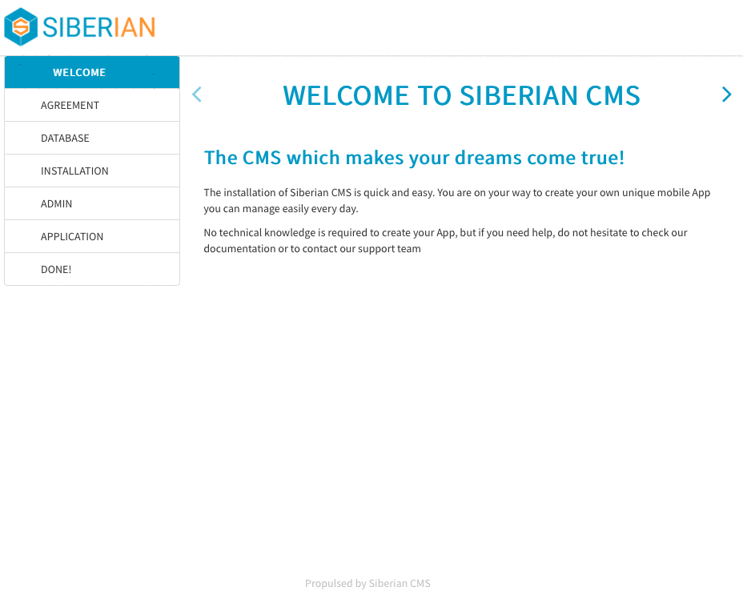

# SiberianCMS: SAE Single App Edition

[Public Roadmap](http://board.siberiancms.com/b/7AYdMDEpFcmt3eZtb/siberiancms-public-roadmap)


## Documentation

* [User documentation](http://doc.siberiancms.com)
* [Developer documentation](http://developer.siberiancms.com)

## Installation

### Configuration

1. First you will need to either checkout the project `git clone https://github.com/Xtraball/SiberianCMS.git`

    or download the [zip archive](https://github.com/Xtraball/SiberianCMS/archive/master.zip) then extract it on your webserver.

2. Run `npm install` then follow the instructions to update your local shell.

3. Run `sb init` to init your local project.

2. Setup your empty database and user

3. Configure your environment with [apache](#apache) or [nginx](#nginx)

#### Apache

If you are running under Apache, be sure that the directive `AllowOverride all` is working, unless the `.htaccess` configuration will fail.

```
<VirtualHost [IP]:80>
        ServerName [yourdomain.tld]

		CustomLog [/path/to/siberiancms]/var/log/httpd.access_log combined
		ErrorLog [/path/to/siberiancms]/var/log/httpd.error_log

		DirectoryIndex index.php

        DocumentRoot [/path/to/siberiancms]

        <Directory [/path/to/siberiancms]>
                Options Indexes FollowSymLinks
                AllowOverride all
        </Directory>

</VirtualHost>
```


#### Nginx

If you are running under Nginx, all you need is in the current configuration, 
please check the `fastcgi` options as they may vary depending on your installation

```
server {
    listen [::]:80;

	root [/path/to/siberiancms];
		
	access_log [/path/to/siberiancms]/var/log/nginx.access_log;
	error_log [/path/to/siberiancms]/var/log/nginx.error_log;

	index index.php index.html index.htm;

	server_name [yourdomain.tld];
	
	location ~ ^/app/configs {
        deny all;
    }
    
    location ~ ^/var/apps/certificates {
        deny all;
    }
    
    # Let's Encrypt configuration
    location = /.well-known/check {
        default_type "text/plain";
        try_files $uri =404;
    }
    
    location ^~ /.well-known/acme-challenge/ {
        default_type "text/plain";
        try_files $uri =404;
    }

	location / {
		try_files $uri /index.php?$query_string;
	}

	location ~ \.php$ {
		fastcgi_index index.php;
		fastcgi_pass 127.0.0.1:9000;
		fastcgi_param SCRIPT_FILENAME $document_root$fastcgi_script_name;
		include fastcgi_params;
		fastcgi_buffers 256 128k;
		fastcgi_connect_timeout 300s;
		fastcgi_send_timeout 300s;
		fastcgi_read_timeout 300s;
	}

    location ~* ^.+.(js|css|png|jpg|jpeg|gif|ico|html)$ {
		access_log        off;
		log_not_found     off;
		expires           0;
	}
	
	location ~ /\. {
		access_log off;
		log_not_found off;
		deny all;
	}

	gzip on;
	gzip_min_length  1000;
	gzip_proxied any;
	gzip_types text/plain application/xml text/css text/js application/x-javascript;
	
	client_max_body_size 256M;

}
```

When you're done with the previous steps, reload your web server.


### Web installer

* Go to `http://yourdomain.tld` then follow the instructions



# Developer package & resources.

---

## Developers

### Platforms

If a custom development is needed for a platform, `cd` to the folder, then push to the local platform, the branch is named `siberian`

- Platforms templates used to build/rebuild are installed from this directory, this ensure the platforms are synced & up-to-date everytime.

- Android* `platforms/cdv-siberian-android`
- iOS* `platforms/cdv-siberian-ios`

The other platforms specific to Siberian which are `cdv-siberian-android-previewer`, `cdv-siberian-ios-previewer` & `cdv-siberian-ios-noads` are automatically synced from their respective parents.

- Rebuilding a platform
    1. run `siberian rebuild platformName` where platformName is `android | android-previewer |ios | ios-noads | ios-previewer | browser`
    2. Wait & see ... the magic happens !

### Plugins

Every plugin used in the project is forked into our GitLab CE, they are added as submodules in the folder `plugins`

A default branch named `siberian` is used to track and lock our modifications.
    
### Modules

Our standalone modules are tracked into the folder `modules` every module has it's own git, and is versioned independantly of the Siberian Editions


# SiberianCMS command-line interface Help

Available commands are: 

|alias|Prints bash aliases to help development|
|clearcache, cc|Clear siberian/var/cache|
|clearlog, cl|Clear siberian/var/log|
|cleanlang|Clean-up duplicates & sort languages CSV files|
|db|Check if databases exists, otherwise create them|
|export-db|Export db tables to schema files|
|init|Initializes DB, project, settings.|
|install|Install forks for cordova-lib.|
|icons|Build ionicons font|
||- install: install required dependencies (OSX Only).|
||icons [install]|
|ions|Start ionic serve in background|
|rebuild|Rebuild a platform:|
||- debug: option will show more informations.|
||- copy: copy platform to siberian/var/apps.|
||- no-manifest: don't call the rebuild manifest hook.|
||rebuild <platform> [copy] [debug] [no-manifest]|
|rebuild-all|Rebuild all platforms|
|syncmodule, sm|Resync a module in the Application|
|type|Switch the Application type 'sae|mae|pe' or print the current if blank|
||note: clearcache is called when changing type.|
||- reset: optional, will set is_installed to 0.|
||- empty: optional, clear all the database.|
||type [type] [reset] [empty]|
|test|Test PHP syntax|
|pack|Pack a module into zip, file is located in ./packages/modules/|
||- If using from a module forlders module_name is optional|
||pack <module_name>|
|packall|Pack all referenced modules|
|prepare|Prepare a platform:|
||- debug: option will show more informations.|
||- copy: copy platform to siberian/var/apps.|
||- no-manifest: don't call the rebuild manifest hook.|
||prepare <platform> [copy] [debug] [no-manifest]|
|manifest|Rebuilds app manifest|
|mver|Update all module version to <version> or only the specified one, in database.|
||- module_name is case-insensitive and is searched with LIKE %module_name%|
||- module_name is optional and if empty all modules versions are changed|
||mver <version> [module_name]|
|npm|Hook for npm version.|
||npm <version>|
|prod|Switch the Application mode to 'production'.|
|dev|Switch the Application mode to 'development'.|
|version|Prints the current SiberianCMS version.|
|linkmodule, lm|Symlink a module from ./modules/ to ./siberian/app/local/modules/|
||lm <module>|
|unlinkmodule, ulm|Remove module symlink|
||ulm <module>|
|syncmodule, sm |Sync all sub-modules/platforms/plugins from git|
